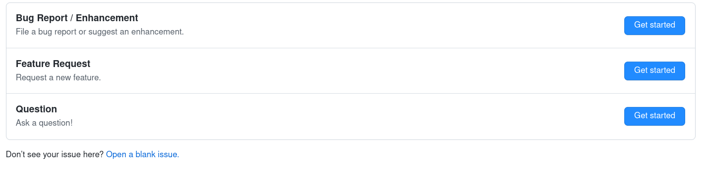

When you find an issue, don't hesitate to create an [issue](https://github.com/lmrtfy/lmrtfy/issues) 
to let us know about the bug. 

When you [create an issue](https://github.com/lmrtfy/lmrtfy/issues/new/choose) there are 3 options:

## Create a bug report

Reporting bugs is very important. We are very thankful for each bug that is reported and will try
to fix them as soon as possible.

The clearer the description of the bug is and the more information you provide, the better.

## Request a feature

This is the best choice if there is a feature you are missing. Each feature request will be reviewed.
If the feature aligns with our [vision](vision.md) of LMRTFY.

If we are going to implement the feature it will be added to the roadmap.

## Ask a question
This the best choice if you just want to ask a question about LMRTFY:

* Is a feature planned?
* How to do X?
*...

## Open a blank issue
This should be the last resort and only be used if your concern does not fit into any of the other
categories.
