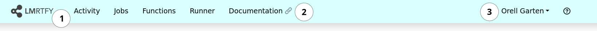
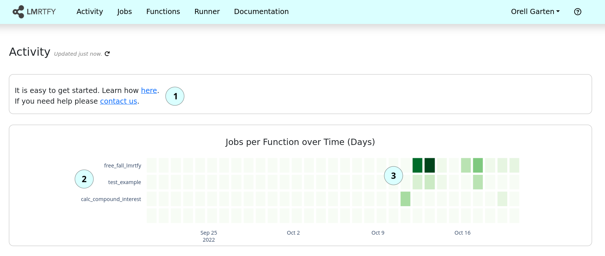
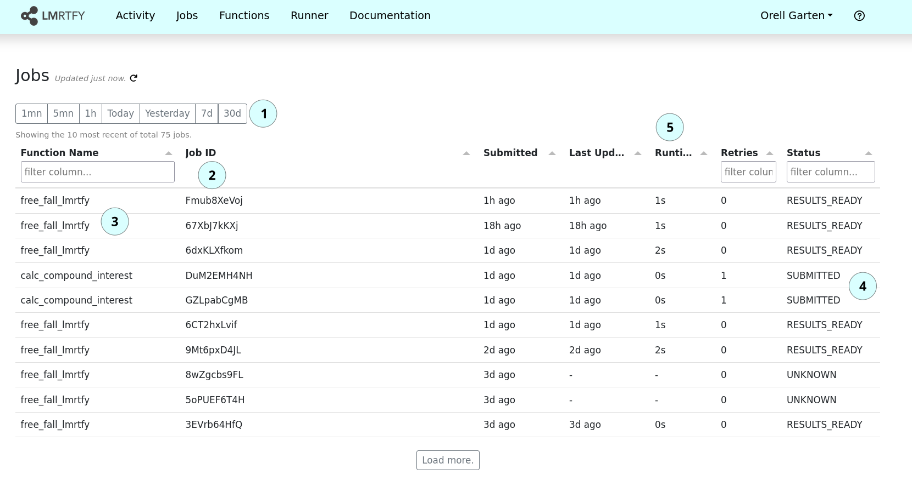
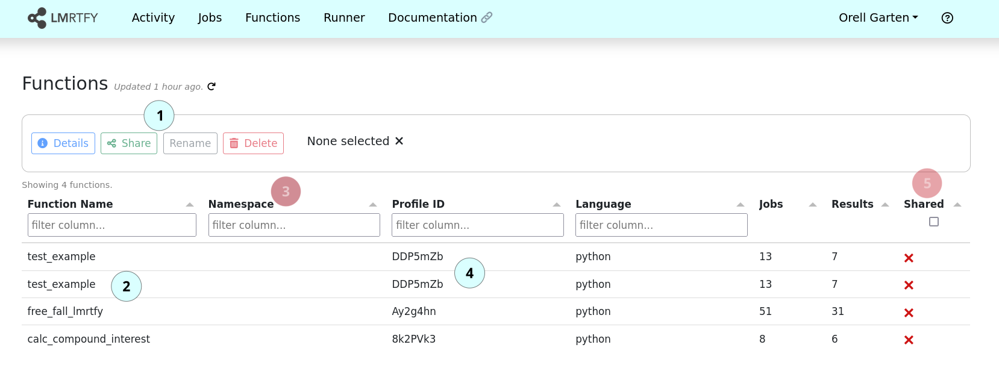
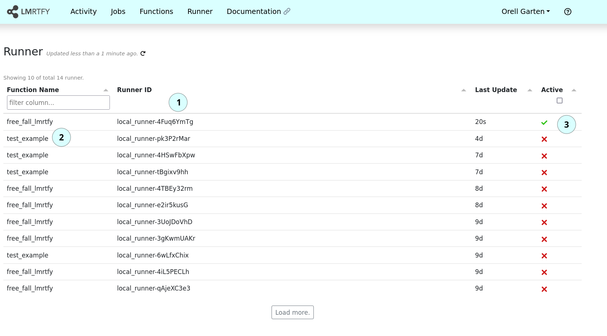

Our web app provides you with information regarding your deployed functions, your runners and 
your jobs. 

The app is work in progress and under constant development. More features will be added. 

Currently, you can do the following things:

* Get an overview of the job activities of your deployed functions.
* Check your submitted jobs, their status and how long they ran.
* Check your function catalog. 
* Check your deployed runners and their status

The navigation is at the top.

(1) The logo leads to our [website](https://lmrt.fyi)

(2) The main navigation is located directly next to the logo. 

(3) On the right side, you find a drop-down menu for profile management.

# Activity view
The activity view is the standard view that you will see when you open the app:

(1) Links to the documentation and our contact in case you need anything!

(2) A list of functions you deployed at least once. Sorted by usage.

(3) The actual activity graph showing how often a function has been used.

!!! note
    If you haven't deployed any functions, you will not see the activity graph.

# Jobs view
The jobs view allows you to see all that you have submitted. You can limit the visible jobs to jobs
in a certain time frame, and also filter by name and status.

(1) Filter jobs by time.

(2) The job ID is always 10 characters long. If you experience any problems with your jobs we will
always ask for the job ID. 

(3) Each job is tied to a specific function name which is displayed in this view. 

(4)  The job status is displayed in the last column. If it is `RESULTS_READY` the [results can be 
fetched](../calling_functions/fetch_results.md)

# Functions view
This view shows all the functions that are available in your catalog. Currently, this serves as 
a view into the catalog, but you cannot share, rename or remove yet. 

What you can do, is to check the details of a function. Just click the function and then click on the
`Details` button.

(1) Function actions. Currently, `Details` works but the others don't.

(2) These are the function names that will be available in your catalog and can be called with that. 

(3) The namespaces are currently not displayed correctly.

(4) The profile IDs are 7 characters long and unique for a specific function. 

(5) The last columns indicates whether a function has been shared or not. (under construction)

# Runners view
This view shows all runner that you have ever deployed. Each one has a unique runner ID which was 
bound to a specific function.

You can check the runner status here, which is useful if you deployed on a remote machine.

(1) The unique runner ID for each runner that has been deployed

(2) The function that was served by a specfific runner

(3) Check whether a runner is active or not. If a runner has not been active for more than a few minutes
it's likely in an erroneous state and should be restarted.