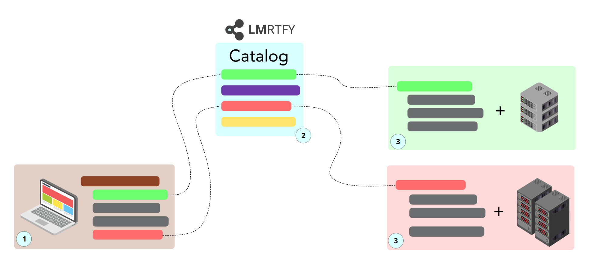

The overall system architecture is straight-forward and consists of three parts:

* the LMRTFY catalog (2) keeping track of all available functions
* a function that is made available to the catalog
* the end-user who calls functions available in the catalog

How these three parts play together can is shown here:

## (1) End-User Code

The end-user writes code that looks just like any other code. However, the red and green functions 
are imported from the LMRTFY catalog.

The user executes their script just like any other script and the functions from the catalog are
automatically dispatched to via the LMRTFY catalog.

## (2) LMRTFY Catalog

The LMRTFY catalog is a registry of all available functions. It also manages authentication for you.

Each user has their own private catalog but functions can be shared with others. All you need is 
an e-mail address.

The functions in the catalog are not actual functions, because their **code itself is not uploaded**
to the catalog. Only the interface that is needed to call the function is uploaded. This way you
can protect your code if you want to while still sharing its functionality. 

The catalog currently allows you to

* ... register functions and workers at the catalog.
* ... **call functions** available in the catalog.
* ... **share functions** with colleagues and collaborators.

When an end-user calls an available function, the catalog automatically dispatches the call to a 
worker. If no worker is available for the corresponding function an error will be returned. This is
the case if you haven't started a runner. 

If the function has been shared with you, it's the responsibility
of the owner of the function to make sure that a runner is available.

## (3) The Workers

A worker, sometimes also called runner, is a unit of three components:

* the actual implementation of the function
* the environment including all environment variables and dependencies
* (special) compute resource the function runs on 

??? question "Where can I run a worker?"
    A worker can run on any system that you want:

    * your laptop
    * a server under your control
    * an EC2 instance
    * a raspberry pi
    * ...

Each worker connects to the catalog and waits for function calls which are executed by the worker. 

If multiple workers serve the function, a round-robin system is used to distribute the compute load.

The fact that a worker can run anywhere you want, as long as an internet connection is available is
really powerful and enables some interesting use-cases. The implementation of an algorithm may never 
leaver your laptop or your own servers as long as you don't choose to do so. Only the interface is
made available to via the catalog. Technically, this creates a black box around your code. However, 
others can still use it perfectly fine.

